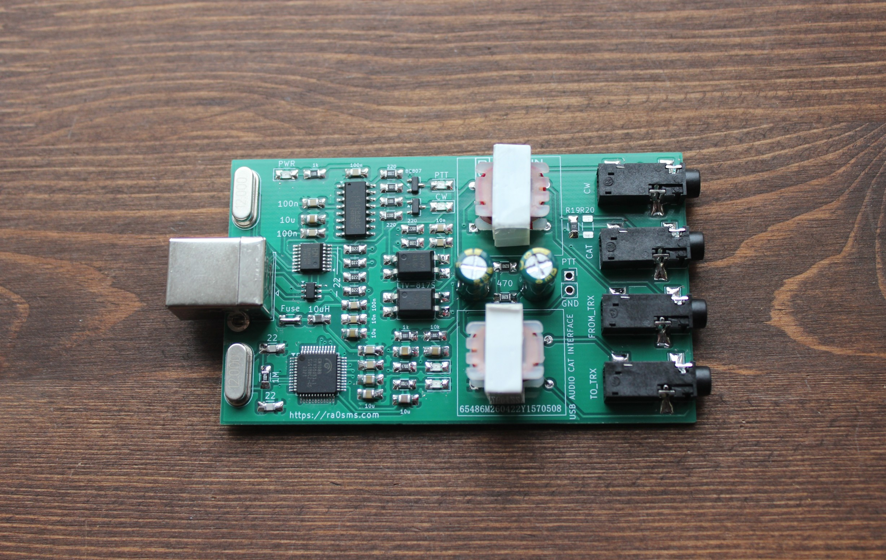
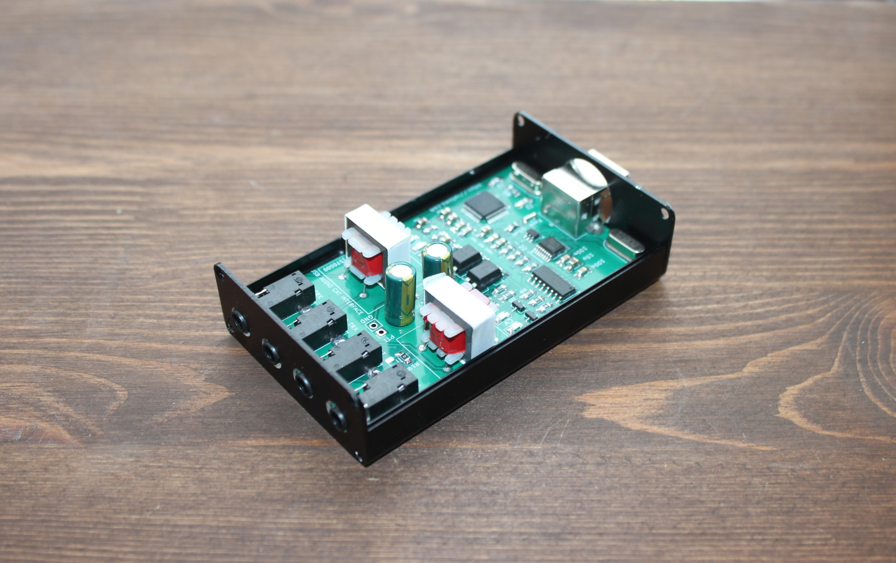
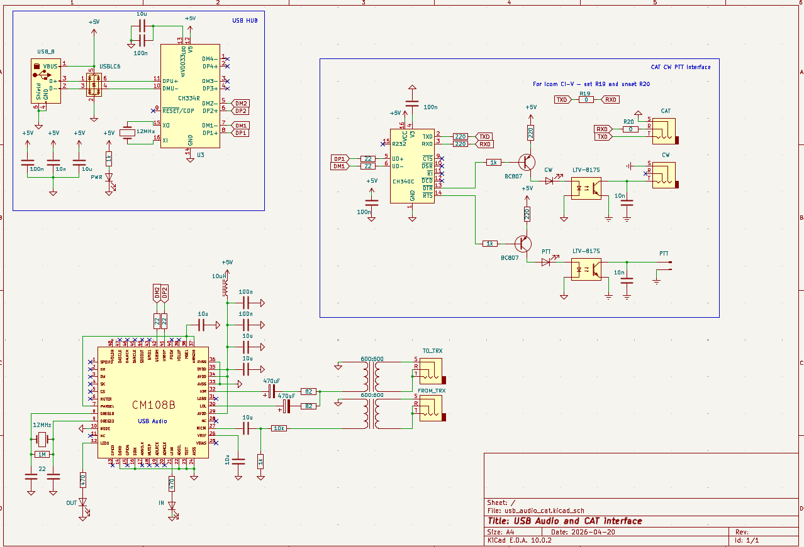

## USB AUDIO CAT PTT CW interface for any transceiver

One USB connection - two USB devices. 

USB Audio Codec and COM-port for CAT CW and PTT.

More information - https://ra0sms.com/usb-audio-cat-interface/

-------------------------------------------

PCB dimension: 80*48 mm

[Gerber files](KIcad/usb_audio_cat/usb_audio_cat_gerbers.zip)

[Schematic](KIcad/usb_audio_cat/usb_audio_cat.pdf)

Recommended enclosure - 80-50-20 mm (https://aliexpress.ru/item/1005006828585850.html)

### PCB

### Boxed version

### Schematic

